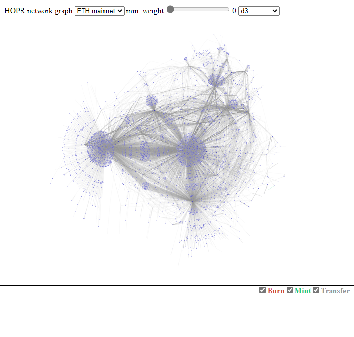
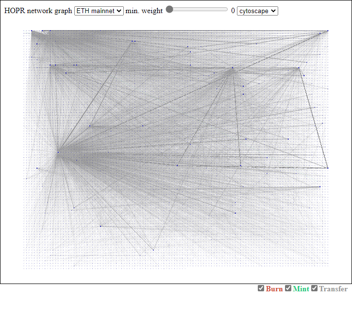
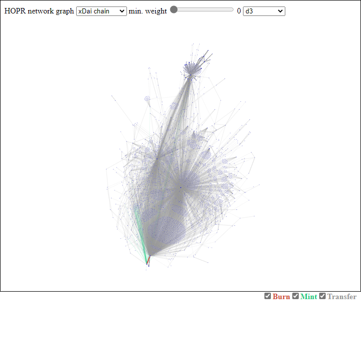

# hopr-network-graph

A visualization approach to gain a bird view on the HOPR token transfers on Ethereum mainnet and xDai chain.

<h1 align="center">
	
</h1>

#### Table of Content
1. [Configure](#configure)
2. [Install](#install)
3. [Extract data](#extract)
4. [Build](#build)

## Configure <a name="configure"></a>

Location: `\src\assets\config.json`

```js
{
  // The minimum weight of a node required to be rendered. (0-100)
  // A node represents a smart contract address and weight is simply the amount of transfers. (capped at 100)
  "minWeight": 20
  // The pre-selected chain when running the application.
  // 0 = Test (for development only)
  // 1 = Ethereum mainnet
  // 2 = xDai chain
  "selectedChainType": 1,
  // The pre-selected library used to render the graph.
  // 0 = D3
  // 1 = Cytoscape
  "selectedGraphLibraryType": 0,
  // Contains the configuration for each chain.
  "chains": [
    {
      // The chain type. (1 = Ethereum mainnet, 2 = xDai chain)
      "type": 1,
      // The URL used to establish a connection with the chain. 
      // (e.g. Alchemy, Infura, localhost, etc.)
      "rpcProviderUrl": "https://eth-mainnet.alchemyapi.io/v2/..."
    }
  ]
}
```

## Install <a name="install"></a>

In order to run HORP network graph, ensure that you have [Git](https://git-scm.com/downloads) (v2.28.0+) and [Node.js](https://nodejs.org/) (v14.16.1+) installed.

Clone the repo:

```bash
git clone https://github.com/hoprnet/hopr-analytics.git
```

Change to the network-graph directory:

```bash
cd hopr-analytics/network-graph
```

Install dependencies:

```bash
npm install
```

## Extract data <a name="extract"></a>

Run the following command to extract events (mint, burn and transfer) from Ethereum mainnet and xDai chain.
This process takes serveral minutes to complete.
Finally the output will be stored in the `\src\assets\data` folder which is excluded in the .gitignore file.

IMPORTANT: Don't forget to set `rpcProviderUrl` for Ethereum mainnet in the `config.json` file. (e.g. https://eth-mainnet.alchemyapi.io/v2/...)

```bash
npx ts-node -P tsconfig.commonjs.json ./extract.ts
```
[npx](https://docs.npmjs.com/cli/v7/commands/npx) runs a command from a local or remote npm package.
[ts-node](https://github.com/TypeStrong/ts-node) compiles the code on the fly and runs it through node.

## Build <a name="build"></a>

Use one of the following commands to build:

```
npm run build            # Builds the project and stores artifacts in the `dist/` directory. 
                         # Use the `--prod` flag for a production build.
npm run start            # Starts a development server. Navigate to `http://localhost:4200/`. 
                         # The app will automatically reload if you change any of the source files.
npm run test             # Executes the unit tests via [Karma](https://karma-runner.github.io).
npm run e2e              # Executes the end-to-end tests via [Protractor](http://www.protractortest.org/).
```

## Further help

This project was generated with [Angular CLI](https://github.com/angular/angular-cli) version 11.2.11.
To get more help on the Angular CLI use `ng help` or go check out the [Angular CLI Overview and Command Reference](https://angular.io/cli) page.

### Code scaffolding

Run `ng generate component component-name` to generate a new component. You can also use `ng generate directive|pipe|service|class|guard|interface|enum|module`.

#### Ethereum mainnet using d3
<h1 align="center">
	
</h1>

#### Ethereum mainnet using cytoscape
<h1 align="center">
	
</h1>

#### xDai chain using d3
<h1 align="center">
	
</h1>

#### xDai chain using cytoscape
<h1 align="center">
	
</h1>